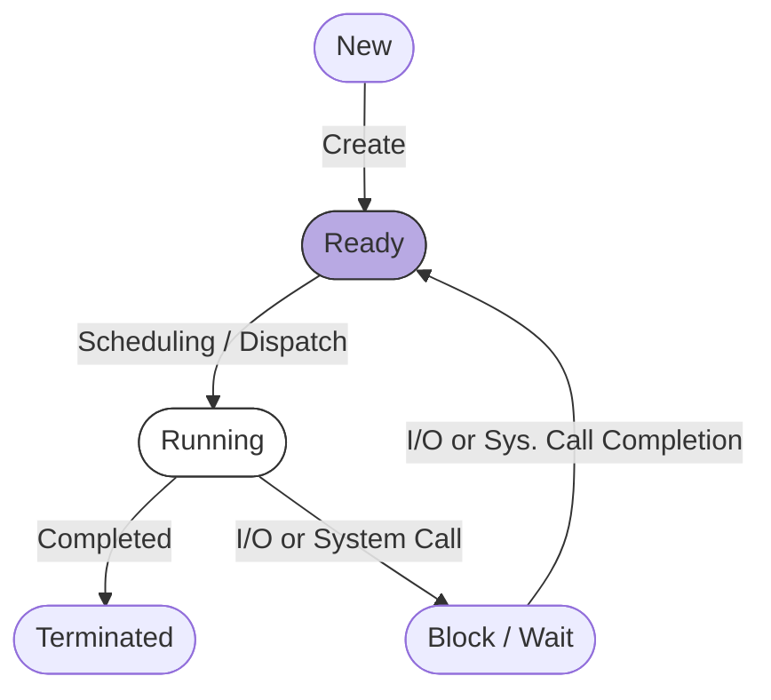
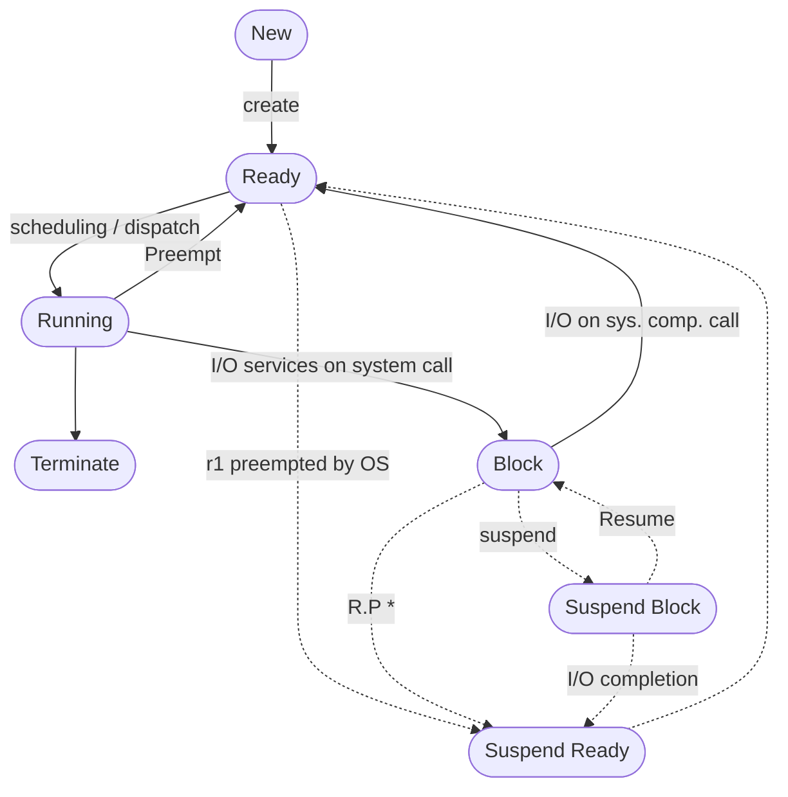

#operating-systems

All the attributes mentioned in [[OS D2]] are stored in a PCB (**Process Descriptor Block**).
The total content of the PCB is process context/environment.
##### Process Life Cycle
This diagram is for a Non Pre-emptive OS. 

Maximum processes in ready/blocked state = theoretically infinite (Honestly depends on RAM)
Maximum processes in the Running state = Number of CPU's

The main memory contains the processes in ready, running and blocked state.
The moving of some processes from main memory to hard disk to improve performance is called **suspension**.
Best states for suspension is the **Ready** state.
Let a process be in the ready state, its waiting for IO services, the process will be moved to **suspended block** state. Once the data is ready, process becomes **suspended ready** and can be scheduled to run by OS.

#### Process State Diagram

