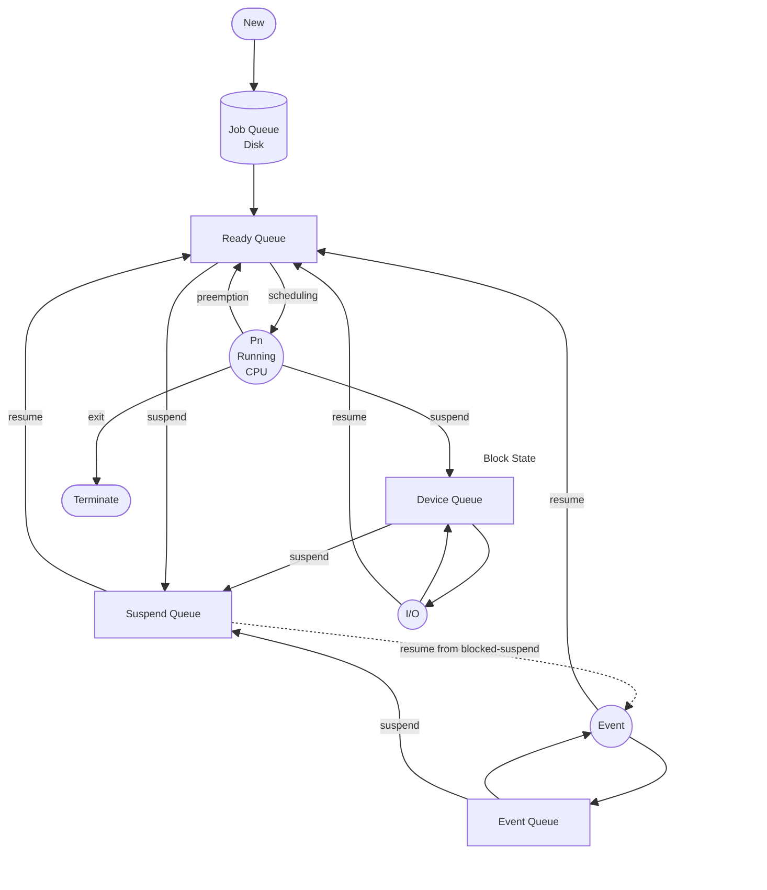

#operating-systems 

Scheduling queues are on **memory** and **disk**. Two types of queues on the memory - **Ready Queue** and **Blocked Queue**. Two types of queues on the disk - **Job Queue** and **Suspend Queue**.

**Scheduler** - component of the OS that makes decisions. Types of schedulers -
1. Long Term - new to ready
2. Short Term (CPU scheduler) - ready to running
3. Medium Term (swapper) - process suspension and resuming

**Dispatcher** - responsible for carrying out the activity of context switching. It works with the short term scheduler. **Context Switching** is the activity of loading and saving the process during a process switch (due to pre-emption or an IO requirement and saving the PCB) on the CPU.

#### Process Times
**Arrival Time** - the time at which process enters ready queue for the first time.
**Waiting Time** - the time spent by the process waiting in the ready queue.
**Burst Time** - the time spent by the process running on the CPU.
**IO Burst Time** - the time spent by the process waiting for IO operation in blocked state.
**Completion Time** - the time taken by the process to go from running to terminated state.
**Turn Around Time** - the time spent by the process to go from new to terminated state.
###### WAITING TIME = TAT - (BT + IOBT)

**Schedule Time** - total time taken to complete all n processes as per schedule
###### L =  Completion time of last process - arrival time of first process

**Throughput** - number of processes completed per unit time. n/L.

*In most modern OS's, when a process calls an IO operation, the process itself does NOT run the IO operation, instead it goes to the blocked state and lets the OS handle the IO operation.*

**Context Switching Time** - scheduling overhead. time taken by dispatcher to load process from ready queue to CPU.

